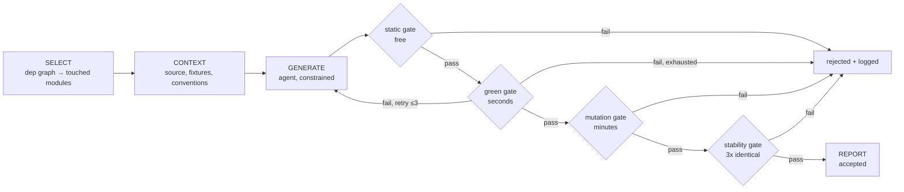
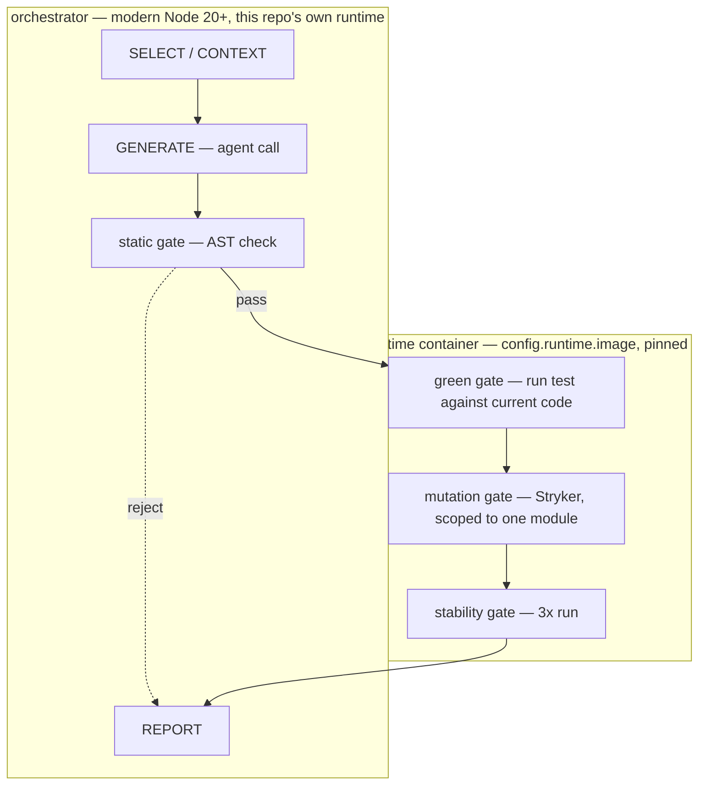

<div align="center">

<picture>
  <source
    media="(prefers-color-scheme: dark)"
    srcset="https://raw.githubusercontent.com/dmserrano/safe-migrate/main/assets/logo/safe-migrate-lockup-light-1040.png">
  <source
    media="(prefers-color-scheme: light)"
    srcset="https://raw.githubusercontent.com/dmserrano/safe-migrate/main/assets/logo/safe-migrate-lockup-1040.png">
  
</picture>

**Verified characterization tests for JS apps facing breaking dependency upgrades.**

[](./LICENSE)
[](https://nodejs.org)
[](#status)

[Why](#why) · [Runtime separation](#runtime-separation) · [How it works](#how-it-works) · [Quickstart](#quickstart) · [Constraints](#constraints-on-generated-tests) · [Status](#status) · [Roadmap](#roadmap)

</div>

---

JS apps fall behind on dependencies fast. Dependabot will tell you a package is a couple
major versions behind — it won't tell you whether upgrading is safe. Without tests that actually
exercise current behavior, "is this safe to merge" becomes a manual audit every time, so
the PR grows stale and the debt compounds.

**safe-migrate** generates that safety net on demand: characterization tests for the
modules a specific upgrade will touch, verified against real defects before they're kept.

## Why

Asking an LLM to "write tests for this file" is easy, and the output usually passes CI
without catching anything real. Two patterns show up constantly:

- **Tests that assert nothing meaningful.** High coverage, zero defect detection.
- **Tests coupled to framework internals.** They break during the exact migration they
  were supposed to protect

safe-migrate treats generation as the *cheap, disposable* step and verification as the
product:

> **The agent is not the product. The verification harness is.**

Every generated test has to survive a gate pipeline before it's allowed to exist. Gates
run cheapest-first and bail on the first failure:



- **static** — AST pass rejects Enzyme, snapshots, internals-poking, self-mocking
- **green** — does it pass against the code as it exists today?
- **mutation** — does it actually *catch* injected bugs, via [Stryker](https://stryker-mutator.io)?
  This is the gate that separates safe-migrate from "LLM writes some tests."
- **stability** — does it pass 3 consecutive identical runs, or is it flaky?

A rejected test with a logged reason is a **successful outcome**, not an error path — the
rejection log is the most credible artifact this tool produces. Most demos in this space
show only successes; that reads as marketing.

## Runtime separation

The orchestrator and the code under test never share a Node version. The orchestrator
runs modern Node; the target repo runs in its own pinned container, because upgrading
*that* runtime is itself one of the migrations this tool needs to support:



## How it works

```
$ safe-migrate --only src/components/Article.js --dry-run

┌─────────────────────────┬───────────┬────────────────┬──────────┐
│ target                  │ status    │ mutation score │ retries  │
├─────────────────────────┼───────────┼────────────────┼──────────┤
│ src/components/Article  │ accepted  │ 0.81           │ 0        │
│ src/components/Feed     │ rejected  │ 0.42 (< 0.60)  │ 3        │
└─────────────────────────┴───────────┴────────────────┴──────────┘
```

Generated tests are **characterization tests** — a term from Michael Feathers' *Working
Effectively with Legacy Code*, meaning a test that pins down what the code *currently*
does, bugs included, rather than asserting what it *should* do. The assertion is "this
did not change," not "this is correct." safe-migrate does not fix bugs it finds; it
captures them so the migration doesn't silently change behavior nobody signed off on.

## Quickstart

> The pipeline above is real but not fully wired — see [Status](#status).
> This section describes the target UX, not what runs today.

```bash
npm install -g safe-migrate   # not published yet
cp node_modules/safe-migrate/safe-migrate.config.example.js safe-migrate.config.js
```

```js
// safe-migrate.config.js
export default {
  target: { root: "../my-legacy-app" },
  runtime: { image: "node:16" },       // the app's own pinned runtime, not yours
  migration: { package: "react", from: "16", to: "18" },
  agent: { provider: "claude-cli" },
};
```

```bash
npx safe-migrate --only src/components/Article.js --dry-run
```

## Constraints on generated tests

Enforced by an AST (abstract syntax tree) pass over each generated test
(`src/constraints.js`), not a linter suggestion — a test coupled to framework internals
breaks during the migration it was supposed to protect.

| Rule | Why |
|---|---|
| No Enzyme | No React 18 support — breaks by construction |
| No snapshot tests | Break on harmless markup changes |
| No `.state()` / `.instance()` / internals | Coupled to framework version, not behavior |
| No mocking the module under test | Tests the mock, not the code |
| No `waitFor` with an empty callback | Common source of false-passing async tests |
| Prefer `getByRole` / `getByLabelText` | Behavior-level; stable across React versions |

## Status

Pre-alpha. Checklist of the pipeline above, in build order — see [`PRD.md`](./PRD.md)
for the full milestone breakdown and reasoning.

1. **SELECT** _Pick what to test_ (planned)
   - Resolves migration.upgrades to affected modules via import-graph walk; ranked by churn × complexity; hardcoded via --only until then.
   - _Figures out which code the upgrade will actually touch, so effort isn't spent testing what's safe already._
2. **CONTEXT**  _Brief the AI_ (live)
   - Assembles module source, import signatures, and a sibling test as a conventions exemplar; the module's own test is physically excluded from context.
   - _Gives the AI everything it needs to write a good test — without letting it just copy the answer that already exists._
3. **GENERATE** _Draft a test_ (live)
   - Single agent call (claude-cli/copilot-cli) returns test source + token usage; bounded to 3 attempts per module.
   - _The only step where AI writes anything. It drafts; it doesn't decide if the draft is good enough._
4. **static gate** _Follows the rulebook?_ (live — gate)
   - AST pass checks for Enzyme, snapshots, internals assertions, self-mocking, empty waitFor; rejects before the test ever runs.
   - _Screens out tests that would break for reasons that have nothing to do with the actual code._
5. **green gate** _Runs cleanly?_ (live — gate)
   - Test executes inside config.runtime.image, scoped to just the new file, with config.runtime.services sharing its network namespace.
   - _Proves the test actually passes against real, working code, in a real copy of its environment._
6. **mutation gate**  _Repeats reliably?_ (planned)
   - No-op stub; will re-run the green gate stabilityRuns (3) times and require identical results.
   - _Makes sure the test isn't randomly flaky — a coin-flip test is worse than no test._
7. **stability gate** _Catches real bugs?_ (planned)
   - Will run Stryker mutation testing scoped to the module, compare against mutationScoreThreshold.
   - _Deliberately breaks the code a little to confirm the test would actually notice — the real proof it's protecting anything._
8. **REPORT** _Accept / Reject_ (planned)
   - All gates pass → accepted into the test set. Any gate fails 3x → rejected, reason logged to the rejection artifact.
   - _A rejection with a clear reason is treated as a success, not a failure — proof the checks aren't rubber-stamping._

## Roadmap

- [ ] Finish workflow pipeline
- [ ] Publish to npm once M5 packaging lands
- [ ] GitHub Action for CI-triggered migrations
- [ ] Provider-agnostic generation (`claude-cli`, `copilot-cli`, SDKs — see PRD § Open questions)

## Contributing

Pre-alpha, single maintainer, milestone-gated — not yet looking for external
contributions. Issues and design feedback are welcome.

## License

MIT
